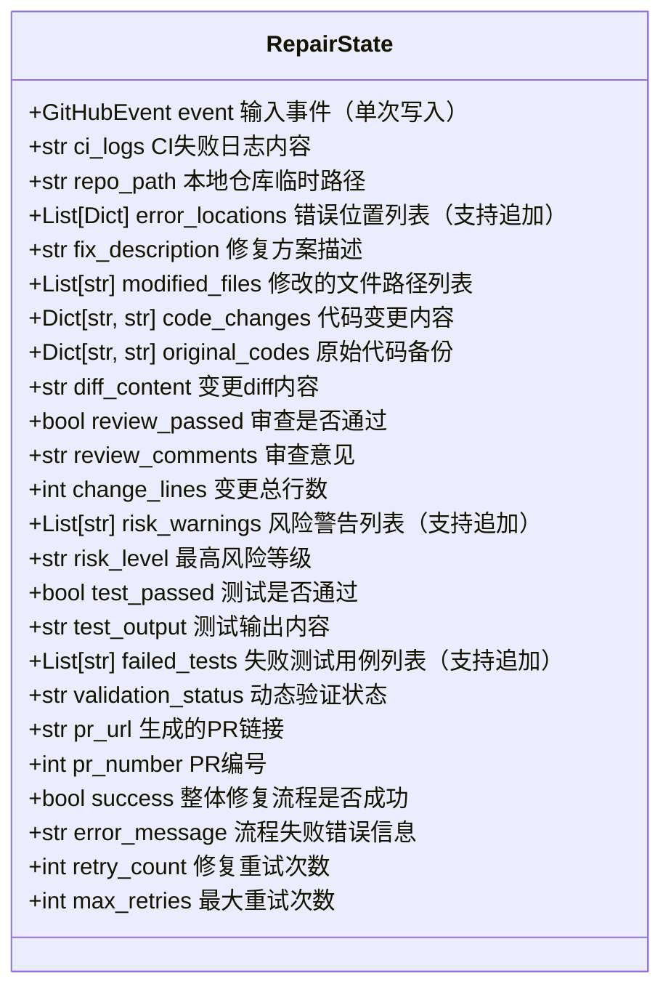
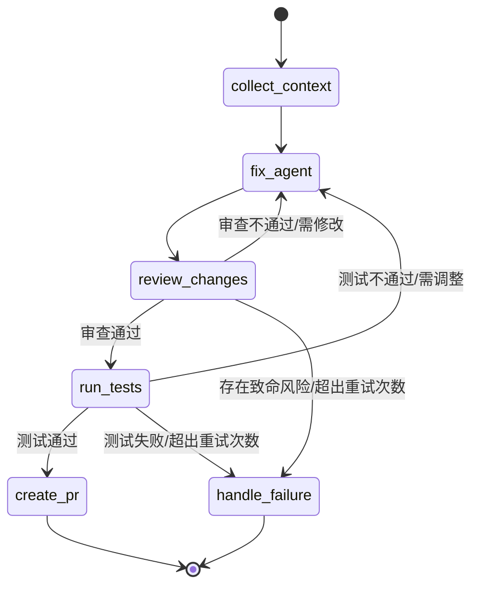

本页面详细描述SpiderClaw系统中基于LangGraph实现的代码自动修复Agent编排工作流，包含状态模型定义、执行节点分工、条件路由规则与异常处理机制，面向需要二次开发编排逻辑的高级开发者。

## 核心状态模型
整个编排流程的核心数据载体为`RepairState`，遵循LangGraph最佳实践设计：使用TypedDict而非Pydantic模型提升性能，对列表类型字段使用`Annotated + operator.add`作为reducer实现数据追加而非覆盖，完整承载从事件触发到PR生成的全链路数据。

Sources: [state.py](src/agent/state.py#L1-L59)

## 编排流程总览
编排器基于LangGraph的`StateGraph`实现，采用声明式流程定义，包含6个核心执行节点和2条条件路由链路，支持动态调整执行逻辑与扩展新节点。

Sources: [orchestrator.py](src/agent/orchestrator.py#L78-L120)

## 核心节点功能详解
### 上下文收集节点（collect_context）
作为流程入口节点，负责完成5项前置准备工作：
1. 事件去重：基于仓库、PR、分支、提交SHA生成唯一键，通过原子锁避免同一事件重复处理
2. 日志下载：从CI事件提供的日志地址拉取失败日志，支持本地测试场景直接传入日志
3. 错误解析：从日志中提取Python错误类型、位置、描述信息，自动过滤ANSI转义字符
4. 仓库克隆：拉取对应分支代码到本地临时目录，供后续修复、审查、测试操作使用
5. 错误过滤：剔除不存在的文件路径对应的无效错误，保留可修复的有效错误
Sources: [orchestrator.py](src/agent/orchestrator.py#L122-L324)

### 修复Agent节点（fix_agent）
接收上下文收集节点输出的错误信息与仓库代码，调用`FixAgent`子系统生成代码修复方案，输出修改后的文件内容、变更diff、修复说明等信息，修复完成后自动跳转到变更审查节点。
Sources: [orchestrator.py](src/agent/orchestrator.py#L89)

### 变更审查节点（review_changes）
调用`ReviewAgent`子系统对修复方案进行安全性、合规性校验：
- 统计变更总行数，校验是否超出`max_change_lines`配置限制
- 识别风险等级（CRITICAL/HIGH/MEDIUM/LOW/NONE），标记致命风险
- 输出审查意见与风险警告，明确是否需要修改
Sources: [orchestrator.py](src/agent/orchestrator.py#L90)

### 测试验证节点（run_tests）
调用`TestAgent`子系统执行验证逻辑，确认修复方案不会引入新问题：
- 执行项目原有单元测试用例
- 动态验证修复后代码的语法正确性
- 输出测试结果与失败用例详细信息
Sources: [orchestrator.py](src/agent/orchestrator.py#L91)

### PR创建节点（create_pr）
修复方案通过所有校验后，自动完成代码提交全流程：创建远程分支、提交变更、推送代码、生成Pull Request，最终返回PR链接与编号。
Sources: [orchestrator.py](src/agent/orchestrator.py#L92)

### 失败处理节点（handle_failure）
处理所有流程失败场景，记录错误信息、清理临时资源，如启用飞书通知则推送失败告警给指定用户。
Sources: [orchestrator.py](src/agent/orchestrator.py#L93)

## 条件路由规则
### 审查后路由规则
| 触发条件 | 跳转目标节点 |
| --- | --- |
| 审查不通过且`retry_count < max_retries` | fix_agent（返回重新修复） |
| 审查通过且无CRITICAL级风险 | run_tests（进入测试验证阶段） |
| 存在CRITICAL级风险或`retry_count >= max_retries` | handle_failure（流程终止） |
Sources: [orchestrator.py](src/agent/orchestrator.py#L103-L107)

### 测试后路由规则
| 触发条件 | 跳转目标节点 |
| --- | --- |
| 测试不通过且`retry_count < max_retries` | fix_agent（返回重新修复） |
| 所有测试用例执行通过 | create_pr（进入PR生成阶段） |
| 测试失败且`retry_count >= max_retries` | handle_failure（流程终止） |
Sources: [orchestrator.py](src/agent/orchestrator.py#L110-L114)

## 重试与去重机制
### 修复重试
最多支持`max_retries`次修复重试（默认3次），每次修复失败后重试次数自动累加，超出上限后流程直接终止，避免无限循环消耗资源。
### 事件去重
采用分布式原子锁机制确保同一事件仅处理一次，去重键生成优先级为：
1. PR编号 + 分支名称（最高优先级）
2. 分支名称 + 提交SHA
3. 单独提交SHA
4. 事件ID（兜底方案）
Sources: [orchestrator.py](src/agent/orchestrator.py#L136-L182)

## 后续阅读推荐
- 了解各子Agent的实现细节：[Agent Subsystem Deep Dive](11-agent-subsystem-deep-dive)
- 开发自定义子Agent扩展修复能力：[Custom Subagent Development](19-custom-subagent-development)
- 配置编排器的全局参数：[Configuration System Design](15-configuration-system-design)