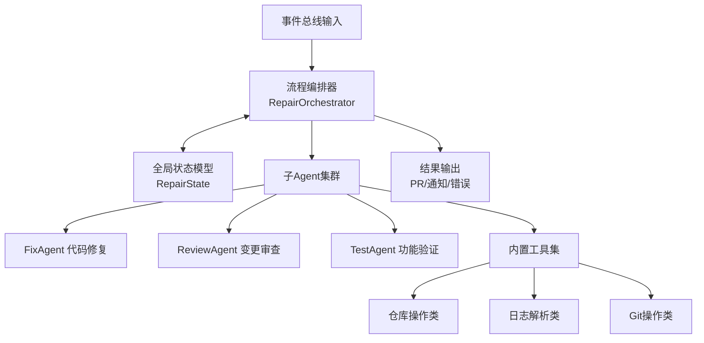
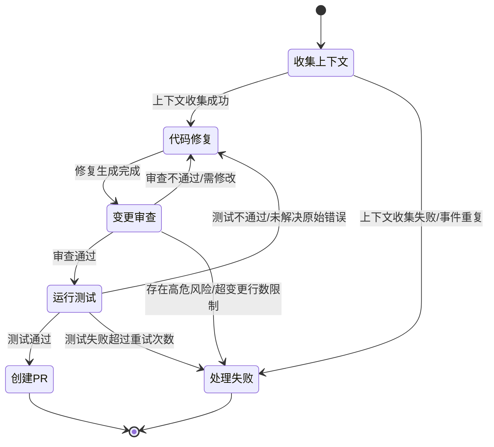

本页面深入解析SpiderClaw核心智能修复引擎——Agent子系统的架构设计、核心组件与工作机制，面向需要进行二次开发、故障排查的高级开发者。Agent子系统基于LangGraph状态驱动框架实现多Agent协作，完整覆盖代码错误自动修复全链路流程。

## 核心架构总览
Agent子系统采用**状态中心化+分层编排**的架构设计，核心分为四大模块：流程编排器、全局状态模型、子Agent集群、内置工具集，所有模块通过统一状态实现数据流转与协同。

Sources: [orchestrator.py](src/agent/orchestrator.py#L1-L77), [state.py](src/agent/state.py#L1-L59)

## 核心组件详解
### 全局状态模型 RepairState
RepairState是整个Agent子系统的唯一数据源，遵循LangGraph最佳实践设计，所有节点的输入输出均基于该状态模型实现。状态字段分为六大类：
| 字段分类 | 核心能力 | 设计特性 |
|---------|---------|---------|
| 输入事件字段 | 存储上游事件总线传入的GitHub事件原始数据 | 单次写入，全局不可修改 |
| 上下文收集字段 | 存储CI日志、仓库路径、错误解析结果等前置数据 | 列表类型字段使用`Annotated[List, operator.add]` reducer实现追加写入，避免覆盖 |
| 修复阶段字段 | 存储修复方案、代码变更、diff内容等修复产出 | 支持增量更新，保留原始代码便于回滚 |
| 审查阶段字段 | 存储审查结果、风险等级、变更行数等安全校验结果 | 多维度风险分级，支持安全护栏拦截 |
| 测试阶段字段 | 存储测试输出、失败用例、验证状态等验证结果 | 兼容多种验证方式（命令执行/AST静态检查/降级测试） |
| 流程控制字段 | 存储重试次数、最大重试阈值等调度参数 | 独立于业务字段，避免状态污染 |

Sources: [state.py](src/agent/state.py#L7-L58)

### 流程编排器 RepairOrchestrator
编排器是Agent子系统的调度核心，基于LangGraph StateGraph实现可观测、可回溯的状态流转。
#### 核心初始化参数
| 参数名 | 类型 | 默认值 | 作用 |
|-------|-----|-------|------|
| github_token | str | 必填 | GitHub API访问凭证 |
| llm_model | str | gpt-4o | 子Agent调用的大模型版本 |
| max_retries | int | 3 | 修复失败最大重试次数 |
| max_change_lines | int | 20 | 单次修复最大允许变更行数，超过自动拦截 |
| lark_notify_enabled | bool | False | 是否启用飞书修复进度通知 |

#### 内置去重机制
编排器内置并行事件去重逻辑，通过原子锁实现多并发场景下的事件幂等处理：优先使用`仓库+PR编号+分支`作为去重key，降级场景使用`仓库+提交SHA`、`事件ID`作为兜底，避免同一事件被重复执行浪费资源。
Sources: [orchestrator.py](src/agent/orchestrator.py#L33-L182)

### 子Agent集群
Agent子系统采用职责分离的多Agent设计，三个子Agent各司其职，通过编排器调度实现协作：
1. **FixAgent**：负责解析错误信息、生成修复方案、修改目标代码，是核心修复能力的载体
2. **ReviewAgent**：负责审查代码变更的正确性、安全性、合规性，检查变更行数、风险点，拦截不符合要求的修复
3. **TestAgent**：负责运行目标项目的测试用例、静态检查，验证修复是否解决原始问题且无回归
Sources: [orchestrator.py](src/agent/orchestrator.py#L13-L15), [subagents目录](src/agent/subagents)

### 内置工具集
子Agent的所有外部操作均通过标准化工具实现，内置工具覆盖四大类场景：
| 工具分类 | 核心工具 | 作用 |
|---------|---------|------|
| 上下文收集工具 | download_ci_logs、parse_python_errors | 下载CI日志、解析错误位置与类型 |
| 仓库操作工具 | clone_repository、set_tool_context | 克隆目标仓库、配置工具全局上下文 |
| Git操作工具 | get_diff、create_branch、commit_changes、push_branch、create_pull_request | 完整Git提交流程封装 |
| 通知工具 | send_repair_notification | 飞书修复进度通知发送 |
Sources: [orchestrator.py](src/agent/orchestrator.py#L16-L28)

## 标准修复工作流程
Agent子系统的修复流程通过状态图预定义，所有流转逻辑可追溯、可扩展：

流程支持自动重试：当审查或测试不通过且未超过`max_retries`阈值时，会自动回到代码修复节点重新生成方案，重试次数累加到状态的`retry_count`字段。
Sources: [orchestrator.py](src/agent/orchestrator.py#L78-L120)

## 扩展开发指引
如需扩展Agent子系统能力，请参考对应开发文档：
- 自定义新的子Agent：[Custom Subagent Development](19-custom-subagent-development)
- 新增Agent可用工具：[Custom Tool Development](18-custom-tool-development)
- 修改子Agent提示词：[Prompt Customization Guide](20-prompt-customization-guide)
- 了解Agent上层调度逻辑：[Agent Orchestration Workflow](10-agent-orchestration-workflow)