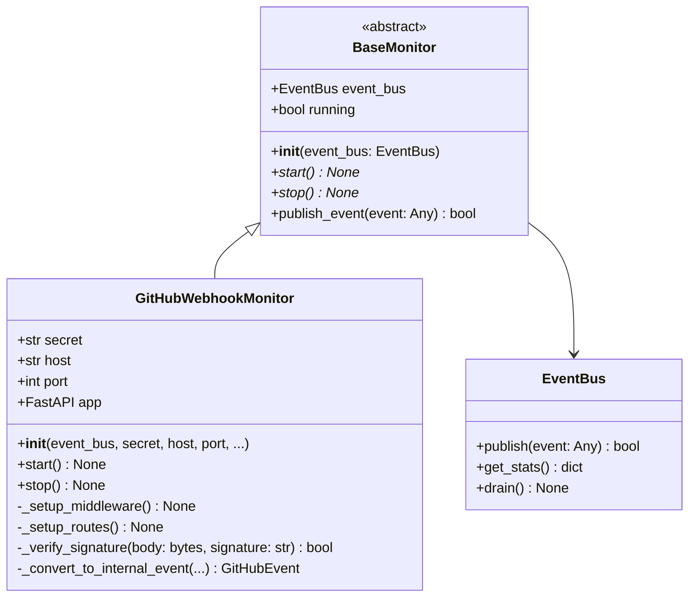
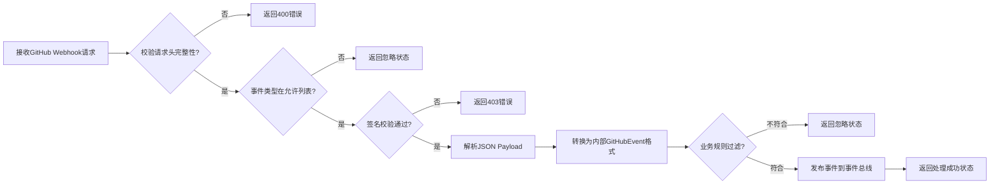

Monitor 子系统是 SpiderClaw 的事件入口层，负责统一接收、校验、过滤外部系统事件并投递到核心事件总线，是触发后续自动修复流程的唯一入口。当前版本默认实现了 GitHub Webhook 监控器，支持扩展其他代码托管/CI 平台的监控源。

## 架构设计
Monitor 子系统采用抽象基类 + 具体实现的分层设计，保证了监控源的可扩展性，所有监控器共享统一的事件投递接口，与下游事件总线解耦。

Sources: [base.py](src/monitor/base.py#L1-L41), [webhook_server.py](src/monitor/webhook_server.py#L25-L60)

## 核心抽象层 BaseMonitor
BaseMonitor 是所有监控器的抽象基类，定义了监控器的统一接口规范：
1. 构造函数强制传入事件总线实例，保证所有监控器共享同一个事件投递通道
2. 抽象 `start()` 和 `stop()` 方法，要求所有具体监控器实现异步启停逻辑
3. 封装 `publish_event()` 公共方法，统一事件投递逻辑，无需具体实现重复开发
4. 内置 `running` 状态变量，避免重复启动/停止问题

该设计的核心优势是新监控源扩展成本极低，仅需继承 BaseMonitor 实现启停逻辑，即可复用现有事件投递、状态管理能力。
Sources: [base.py](src/monitor/base.py#L1-L41)

## GitHub Webhook 监控实现
GitHubWebhookMonitor 是当前默认提供的生产级监控实现，基于 FastAPI 构建高性能 Webhook 服务，完整覆盖 GitHub 事件接收、安全校验、过滤、格式转换全流程。

### 核心配置参数
| 参数名 | 类型 | 默认值 | 说明 |
|--------|------|--------|------|
| event_bus | EventBus | 必传 | 全局事件总线实例 |
| secret | str | 必传 | GitHub Webhook 签名密钥，用于校验请求合法性 |
| host | str | 0.0.0.0 | 服务监听地址 |
| port | int | 8000 | 服务监听端口 |
| reload | bool | False | 是否启用热重载（仅开发环境使用） |
| allowed_events | set[str] | {"workflow_run", "pull_request", "check_run"} | 允许处理的 GitHub 事件类型集合 |
Sources: [webhook_server.py](src/monitor/webhook_server.py#L45-L60)

### 安全校验机制
为防止伪造 Webhook 请求攻击，服务实现了严格的签名校验逻辑：
1. 强制验证所有请求必须携带 `X-GitHub-Delivery`、`X-GitHub-Event`、`X-Hub-Signature-256` 三个请求头
2. 使用 HMAC-SHA256 算法计算请求体的签名，与请求头携带的签名进行对比（采用 `hmac.compare_digest` 避免时序攻击）
3. 签名校验失败的请求直接返回 403 错误，不进入后续处理流程
Sources: [webhook_server.py](src/monitor/webhook_server.py#L120-L138, L201-L215)

### 事件处理流程

业务过滤规则说明：
- `pull_request` 事件仅处理 `opened` 和 `synchronize` 动作，用于获取 PR 编号和分支信息
- `workflow_run` 和 `check_run` 事件仅处理 `conclusion = failure` 的失败事件，作为自动修复的触发源
Sources: [webhook_server.py](src/monitor/webhook_server.py#L90-L195)

### 优雅启停机制
- 启动时基于 Uvicorn 运行异步 Web 服务，支持热重载开发模式
- 停止时首先标记服务退出状态，等待正在处理的请求完成，再调用事件总线 `drain()` 方法排空队列中的所有事件，避免事件丢失
Sources: [webhook_server.py](src/monitor/webhook_server.py#L316-L354)

## 可观测能力
1. **健康检查端点**：`/health` 接口返回服务运行状态、启动时间、事件总线统计信息，可用于监控告警和负载均衡健康检查
2. **请求日志中间件**：自动记录所有 Webhook 请求的事件ID、事件类型、响应状态、处理耗时，便于问题排查
3. **运行状态面板**：启动时输出可视化运行面板，展示监听地址、端点、允许事件、自动修复状态等核心信息
Sources: [webhook_server.py](src/monitor/webhook_server.py#L74-L89, L377-L400)

## 扩展指南
如需接入其他监控源（如 GitLab Webhook、Jenkins 回调等），只需按以下步骤实现：
1. 继承 `BaseMonitor` 抽象类
2. 实现 `start()` 和 `stop()` 方法，完成监控服务的启停逻辑
3. 将接收的外部事件转换为内部统一事件格式（或自定义事件格式，需同步修改事件总线消费者逻辑）
4. 调用 `self.publish_event()` 方法投递事件到总线即可

## 下一步阅读
- 了解事件投递后的流转逻辑：[事件总线设计与实现](9-event-bus-design-and-implementation)
- 了解事件触发后的修复流程：[Agent Orchestration Workflow](10-agent-orchestration-workflow)
- 配置 GitHub Webhook 接入：[GitHub Webhook Configuration](6-github-webhook-configuration)