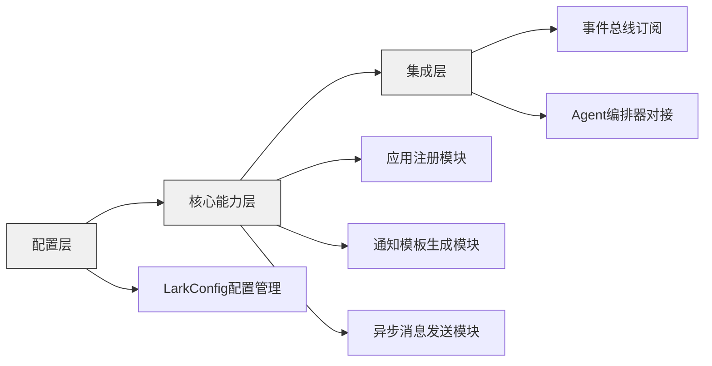
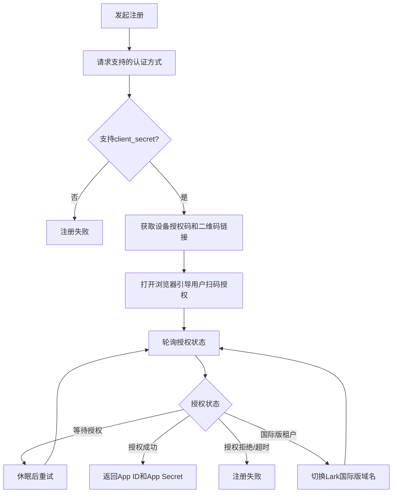

本页面深入解析SpiderClaw通知子系统的架构设计、核心能力与实现细节，帮助中级开发者理解通知流转逻辑、进行二次开发或排查问题。通知子系统当前仅支持飞书（Lark）作为消息通道，实现了自动修复结果的实时推送能力。

## 整体架构
通知子系统采用三层分层设计，与核心业务模块完全解耦，通过事件总线实现消息触发：

通知子系统不主动轮询业务状态，完全依赖事件驱动，当Agent子系统完成修复任务后会发布对应事件，通知子系统消费事件后自动生成并推送消息。
Sources: [__init__.py](src/notify/__init__.py#L1-L20), [settings.py](src/config/settings.py#L58-L65)

## 核心功能模块
### 1. 飞书应用一键注册模块
无需手动访问飞书开发者后台，通过设备授权流一键完成自建应用注册，自动获取App ID和App Secret：

注册逻辑完全兼容飞书国内版和Lark国际版，自动识别租户品牌切换域名，支持超时重试和代理配置。
Sources: [lark_register.py](src/notify/lark_register.py#L1-L156)

### 2. 通知模板生成模块
内置两种通知模板，满足不同场景需求：
| 模板类型 | 适用场景 | 消息格式 | 核心参数 |
| --- | --- | --- | --- |
| 修复结果卡片 | 自动修复完成/失败通知 | 交互式卡片 | 修复状态、错误类型、分支信息、PR链接、失败原因 |
| 简单文本通知 | 系统告警、状态提示 | 纯文本/post格式 | 通知标题、内容文本 |

修复结果卡片会根据修复状态自动切换样式：成功时为绿色主题，附带PR跳转按钮；失败时为红色主题，展示具体错误原因。
Sources: [lark_notify.py](src/notify/lark_notify.py#L13-L148)

### 3. 异步消息发送模块
基于lark-cli实现异步消息发送，无需手动处理飞书API认证和令牌刷新：
- 支持两种接收ID类型：用户open_id、群组chat_id
- 自动处理命令行参数转义和编码
- 完整的错误日志记录和返回值标识
- 支持以机器人或用户身份发送消息

发送逻辑默认隐藏敏感信息，日志中不输出消息内容，避免泄露业务数据。
Sources: [lark_notify.py](src/notify/lark_notify.py#L151-L422)

## 配置项说明
通知子系统所有配置均通过`LarkConfig`管理，支持YAML配置文件和环境变量两种注入方式：
| 配置项 | 类型 | 默认值 | 说明 |
| --- | --- | --- | --- |
| enabled | bool | False | 是否启用飞书通知功能 |
| app_id | string | "" | 飞书应用ID，通过注册功能获取 |
| app_secret | string | "" | 飞书应用密钥，通过注册功能获取 |
| notify_users | list[string] | [] | 需要通知的用户open_id列表 |
| notify_groups | list[string] | [] | 需要通知的群组chat_id列表 |

配置优先级：环境变量 > YAML配置文件 > 默认值，配置方法可参考 [Feishu/Lark Notification Setup](7-feishu-lark-notification-setup)。
Sources: [settings.py](src/config/settings.py#L58-L65)

## 与其他模块的交互
通知子系统通过事件总线与核心业务模块解耦，交互流程如下：
1. Agent编排器完成修复任务后，发布`repair_completed`事件到事件总线
2. 通知子系统订阅事件总线的修复完成事件
3. 读取配置中的通知接收人列表，批量生成对应通知卡片
4. 异步调用lark-cli发送消息，记录发送结果日志

事件总线的实现细节可参考 [Event Bus Design & Implementation](9-event-bus-design-and-implementation)。
Sources: [event_bus.py](src/bus/event_bus.py#L1-L161)

## 常见问题排查
| 问题现象 | 排查方向 |
| --- | --- |
| 飞书应用注册失败 | 检查网络连接和代理配置，确认用户有企业自建应用创建权限 |
| 通知发送失败 | 检查lark-cli是否正确安装，app_id/app_secret配置是否正确，接收人ID是否有效 |
| 收到重复通知 | 检查事件总线的去重配置，默认已处理事件ID会保留1小时，避免重复消费 |