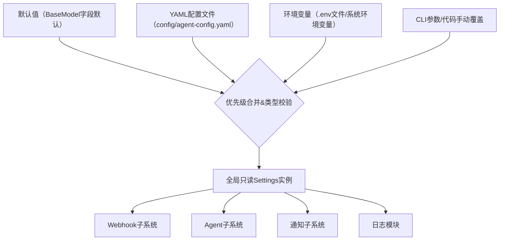

本页面详细介绍SpiderClaw配置系统的设计思路、结构规范、加载逻辑与使用规则，为开发者配置部署系统、扩展配置项提供参考。本配置系统基于Pydantic与Pydantic Settings实现，提供类型安全、多源合并、优先级管控、向后兼容等核心能力。

## 核心架构
配置系统采用四层优先级的分层设计，所有配置项都会经过Pydantic的类型校验，从根源避免非法配置导致的运行时错误，整体架构如下：

Sources: [settings.py](src/config/settings.py#L67-L73)

## 配置优先级规则
配置系统遵循从高到低的四层优先级规则，高优先级配置会自动覆盖低优先级配置，无需手动合并：
| 优先级（从高到低） | 配置来源 | 适用场景 | 说明 |
| --- | --- | --- | --- |
| 1 | 手动参数覆盖 | 代码动态调整、CLI命令参数 | 通过`get_settings`的`overrides`参数传入，优先级最高 |
| 2 | 环境变量 | 容器部署、CI/CD环境、敏感信息存储 | 遵循`前缀__嵌套字段`命名规则，支持从`.env`文件自动加载 |
| 3 | YAML配置文件 | 常规配置持久化 | 默认读取`config/agent-config.yaml`，支持自定义路径 |
| 4 | 代码默认值 | 无特殊配置的默认场景 | 各配置字段内置的默认值，优先级最低 |
Sources: [settings.py](src/config/settings.py#L134-L169)

## 配置模块结构
系统配置按功能划分为六大独立模块，每个模块对应独立的配置段，实现配置的高内聚低耦合：
| 配置段 | 功能描述 | 关联子系统 |
| --- | --- | --- |
| webhook | 控制Webhook服务的监听规则、事件处理容量、安全校验策略 | [Monitor Subsystem Deep Dive](12-monitor-subsystem-deep-dive) |
| logging | 控制日志输出格式、存储路径、保留周期 | - |
| agent | 控制自动修复的行为规则、风险边界、PR创建策略 | [Agent Subsystem Deep Dive](11-agent-subsystem-deep-dive) |
| github | 控制GitHub API访问权限、仓库默认规则 | [GitHub Webhook Configuration](6-github-webhook-configuration) |
| openai | 控制LLM服务的访问参数、模型选择、超时规则 | [Agent Subsystem Deep Dive](11-agent-subsystem-deep-dive) |
| lark | 控制飞书通知的启用状态、接收对象范围 | [Notification Subsystem Deep Dive](13-notification-subsystem-deep-dive) |

核心配置项说明：
| 配置段 | 配置项 | 类型 | 默认值 | 风险等级 | 说明 |
| --- | --- | --- | --- | --- | --- |
| webhook | secret | string | 空 | 高 | GitHub Webhook签名密钥，用于校验事件合法性，生产环境必须配置 |
| agent | enabled | bool | false | 高 | 是否启用自动修复功能，测试环境建议先关闭验证流程 |
| agent | max_change_lines | int | 20 | 高 | 单次修复最大允许变更的代码行数，控制修复风险 |
| agent | require_human_approval | bool | false | 高 | 自动创建PR前是否需要人工审批，生产环境建议开启 |
| github | token | string | 空 | 极高 | GitHub个人访问令牌，需要`repo`权限，禁止写入配置文件 |
| openai | api_key | string | 空 | 极高 | OpenAI API密钥，禁止写入配置文件 |
| lark | enabled | bool | false | 中 | 是否启用飞书事件通知 |
Sources: [settings.py](src/config/settings.py#L9-L96)

## 加载逻辑详解
配置加载流程内置向后兼容处理，避免版本升级导致的配置失效：
1. 调用`get_settings`时，首先尝试从指定路径加载YAML配置文件，若文件不存在则使用默认值初始化
2. 自动执行历史配置兼容转换：若YAML配置中存在旧版`agent.llm_model`字段，会自动迁移到`openai.model_name`字段，不会覆盖现有配置
3. 加载环境变量配置，按照`__`作为嵌套分隔符覆盖对应配置项
4. 应用传入的`overrides`参数覆盖配置，最终返回经过类型校验的全局只读Settings实例
Sources: [settings.py](src/config/settings.py#L97-L169)

## 配置方式示例
### YAML配置方式
推荐常规部署使用YAML配置文件，将`config/agent-config.example.yaml`复制为`config/agent-config.yaml`后修改即可，示例：
```yaml
agent:
  enabled: true
  max_change_lines: 30
  require_human_approval: true
```
Sources: [agent-config.example.yaml](config/agent-config.example.yaml#L1-L48)

### 环境变量配置方式
容器部署或敏感信息配置推荐使用环境变量，将根目录`.env.example`复制为`.env`后修改即可，嵌套配置使用双下划线`__`分隔，示例：
```env
AGENT__ENABLED=true
AGENT__MAX_CHANGE_LINES=30
AGENT__REQUIRE_HUMAN_APPROVAL=true
```
Sources: [.env.example](.env.example#L1-L28)

## 最佳实践
1. 敏感信息（GitHub Token、OpenAI API密钥、飞书密钥）禁止写入YAML配置文件，建议通过环境变量注入，避免代码仓库泄露
2. 生产环境必须开启`agent.require_human_approval`配置，控制自动修复带来的代码变更风险
3. 生产环境必须关闭`webhook.reload`、`debug`配置，提升服务运行稳定性
4. 扩展配置项时优先在对应配置段新增字段，同时补充默认值与类型注解，保证向后兼容

## 下一步阅读
- 基础配置操作请参考：[Basic Configuration](4-basic-configuration)
- Webhook相关配置请参考：[GitHub Webhook Configuration](6-github-webhook-configuration)
- 飞书通知配置请参考：[Feishu/Lark Notification Setup](7-feishu-lark-notification-setup)
- Agent行为配置请参考：[Agent Subsystem Deep Dive](11-agent-subsystem-deep-dive)