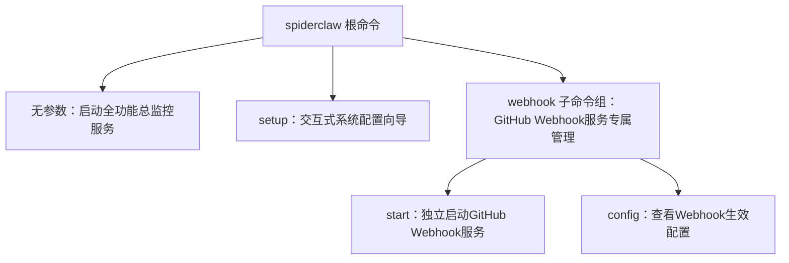

本文档是SpiderClaw命令行工具的完整参考，涵盖所有可用命令、参数说明和典型使用场景，面向需要部署、调试、管理SpiderClaw服务的中级开发者。

## 命令层级结构
SpiderClaw CLI采用分级设计，整体结构如下：

Sources: [app.py](src/cli/app.py#L8-L142)

## 全局公共参数
以下参数适用于所有命令，可在根命令层级指定：
| 参数名 | 简写 | 默认值 | 说明 |
|--------|------|--------|------|
| `--debug` | - | `False` | 开启调试模式，输出更详细的运行日志 |
| `--config` | `-c` | `config/agent-config.yaml` | 指定自定义配置文件路径 |
| `--port` | `-p` | `8000` | Webhook服务监听端口 |
| `--host` | `-h` | `0.0.0.0` | Webhook服务监听地址 |
| `--reload` | - | `False` | 开启代码热重载，仅推荐开发环境使用 |
Sources: [app.py](src/cli/app.py#L107-L113)

## 根命令用法
### 无参数直接运行
直接执行`spiderclaw`命令将启动全功能总监控服务，包含Webhook监听、事件消费、自动修复、通知推送所有模块，是生产环境部署的推荐用法。
Sources: [app.py](src/cli/app.py#L124-L126)

### `setup` 配置向导
执行`spiderclaw setup`将启动交互式飞书通知配置向导，引导用户扫码授权自动创建飞书应用，写入配置文件，无需手动填写飞书App ID、App Secret等参数。配置完成后可直接在配置文件中添加需要通知的用户/群组ID。
Sources: [app.py](src/cli/app.py#L129-L132)

## `webhook` 子命令组
`webhook`子命令组用于单独管理GitHub Webhook服务，适用于需要拆分部署、单独调试Webhook模块的场景。

### `webhook start` 启动Webhook服务
单独启动GitHub Webhook监听服务，可选择性开启自动修复功能，支持通过参数覆盖配置文件中的Webhook相关设置。
| 参数名 | 简写 | 说明 |
|--------|------|------|
| `--host` | - | 覆盖配置文件的监听主机地址 |
| `--port` | `-p` | 覆盖配置文件的监听端口 |
| `--secret` | `-s` | GitHub Webhook校验密钥，未配置时启动失败 |
| `--reload` | - | 开启代码热重载，开发环境使用 |
| `--log-level` | - | 覆盖配置文件的日志级别（DEBUG/INFO/WARN/ERROR） |
| `--config` | `-c` | 指定自定义配置文件路径 |

**使用示例**：
```bash
# 使用默认配置启动Webhook服务
spiderclaw webhook start

# 指定端口和密钥启动
spiderclaw webhook start -p 8080 -s your_github_webhook_secret

# 开发环境开启热重载和调试日志
spiderclaw --debug webhook start --reload --log-level DEBUG
```
Sources: [webhook.py](src/cli/commands/webhook.py#L9-L171)

### `webhook config` 查看生效配置
执行`spiderclaw webhook config`将打印当前生效的Webhook配置和日志配置，自动隐去敏感信息（如Webhook密钥），用于调试配置参数是否正确加载。
支持的参数与`webhook start`一致，可通过参数临时覆盖配置，查看覆盖后的生效结果。
**输出示例**：
```
┏━━━━━━━━━━━━━━━━━━━━━━━━━━━━━━┳━━━━━━━━━━━━━━━━━━━━━━━━━━━━━━┓
┃ 配置项                       ┃ 值                           ┃
┡━━━━━━━━━━━━━━━━━━━━━━━━━━━━━━╇━━━━━━━━━━━━━━━━━━━━━━━━━━━━━━┩
│ webhook.host                 │ 0.0.0.0                      │
│ webhook.port                 │ 8000                         │
│ webhook.secret               │ ********                     │
│ webhook.allowed_events       │ workflow_run, issues         │
│ logging.level                │ INFO                         │
│ environment                  │ production                   │
└──────────────────────────────┴──────────────────────────────┘
```
Sources: [webhook.py](src/cli/commands/webhook.py#L173-L224)

## 下一步阅读
- 生产环境部署CLI命令最佳实践请参考：[生产部署指南](23-production-deployment-guide)
- 命令执行异常排查请参考：[常见问题排查](24-common-troubleshooting)