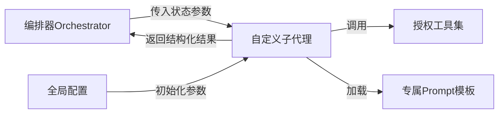
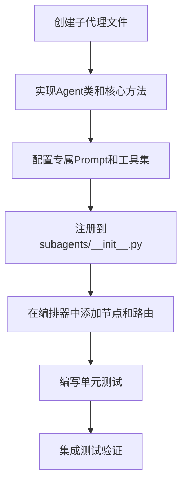

本页面面向高级开发者，介绍如何在SpiderClaw系统中开发自定义子代理扩展功能。子代理是系统中执行特定领域任务的独立逻辑单元，可通过实现标准接口无缝集成到编排流程中，扩展系统的错误修复、代码审查、测试生成等能力。
## 子代理架构规范
SpiderClaw的子代理采用LangChain标准实现模式，与编排器、状态系统、工具集完全解耦，架构关系如下：

所有子代理必须遵循统一的接口规范，才能被编排器正确调度：
1. 必须实现带有初始化参数的类构造函数，支持传入LLM配置、仓库路径、令牌等基础参数
2. 必须实现核心业务方法，接收状态上下文参数，返回结构化处理结果
3. 必须显式声明所使用的工具集，遵循最小权限原则配置工具访问权限
4. 必须支持重试机制和错误处理，避免阻塞整个编排流程
Sources: [fix_agent.py](./src/agent/subagents/fix_agent.py#L1-L317), [orchestrator.py](./src/agent/orchestrator.py#L1-L1219)
## 基础开发规范
### 类结构要求
| 组件 | 要求说明 | 示例 |
| --- | --- | --- |
| 类名 | 采用大驼峰命名，后缀为Agent | `FixAgent`、`ReviewAgent` |
| 构造函数 | 必须包含repo_path、llm相关配置、令牌参数 | 参考`FixAgent.__init__` |
| 核心方法 | 异步方法，接收上下文参数，返回结构化Dict | 参考`FixAgent.generate_fix` |
### 初始化参数规范
所有子代理的构造函数必须支持以下基础参数，可扩展自定义参数：
| 参数名 | 类型 | 必须 | 说明 |
| --- | --- | --- | --- |
| repo_path | str | 是 | 目标仓库的本地路径 |
| llm_model | str | 否 | LLM模型名称，默认使用全局配置 |
| temperature | float | 否 | LLM温度参数，默认0.1 |
| openai_api_key | str | 是 | OpenAI API密钥 |
| openai_base_url | str | 否 | OpenAI API基础URL |
| github_token | str | 否 | GitHub访问令牌 |
### 返回值规范
核心方法必须返回结构化Dict，包含以下必填字段：
| 字段名 | 类型 | 必须 | 说明 |
| --- | --- | --- | --- |
| success | bool | 是 | 处理是否成功 |
| error_message | str | 否 | 处理失败时的错误信息 |
| [业务字段] | Any | 是 | 自定义业务结果字段，如`code_changes`、`review_feedback` |
Sources: [fix_agent.py](./src/agent/subagents/fix_agent.py#L23-L87)
## 开发流程
自定义子代理的完整开发流程如下：

### 步骤1：创建子代理文件
在`./src/agent/subagents/`目录下创建新的Python文件，命名采用下划线分隔，如`custom_agent.py`。
### 步骤2：实现核心逻辑
参考现有子代理的结构实现类和核心方法，示例代码模板如下：
```python
"""自定义子代理实现"""
from typing import Dict, Any
from langchain.agents import create_agent
from langchain_core.prompts import ChatPromptTemplate

from src.agent.tools.langchain_tools import all_tools, set_tool_context
from src.agent.prompts.custom_agent import CUSTOM_AGENT_PROMPT

class CustomAgent:
    def __init__(self, repo_path: str, llm_model: str = "gpt-4o", 
                 openai_api_key: str = None, **kwargs):
        self.repo_path = repo_path
        # 初始化LLM
        self.llm = ChatOpenAI(model=llm_model, api_key=openai_api_key)
        # 配置最小权限工具集
        self.tools = [tool for tool in all_tools if tool.name in ["read_file"]]
        # 创建Agent
        self.agent = create_agent(model=self.llm, tools=self.tools, 
                                 system_prompt=CUSTOM_AGENT_PROMPT)
    
    async def run_custom_task(self, context: Dict[str, Any]) -> Dict[str, Any]:
        # 业务逻辑实现
        set_tool_context({"repo_path": self.repo_path})
        # 调用Agent处理
        result = await self.agent.ainvoke({"input": context["input"]})
        # 解析返回结果
        return {"success": True, "custom_result": result["output"]}
```
### 步骤3：注册子代理
在`./src/agent/subagents/__init__.py`中导入并导出你的子代理类：
```python
from .custom_agent import CustomAgent
__all__ = ["FixAgent", "ReviewAgent", "TestAgent", "CustomAgent"]
```
### 步骤4：集成到编排流程
在`orchestrator.py`中添加子代理的执行节点和路由规则，参考现有子代理的集成方式。
Sources: [subagents/__init__.py](./src/agent/subagents/__init__.py#L1-L17), [orchestrator.py](./src/agent/orchestrator.py#L100-L150)
## 最佳实践
1. **最小权限原则**：仅给子代理配置必须的工具，禁止授予不必要的写入权限
2. **重试机制**：核心方法必须实现重试次数限制，避免死循环和API资源浪费
3. **结构化输出**：所有返回结果必须是可序列化的Dict，禁止返回非结构化文本
4. **日志规范**：必须添加关键节点的日志，便于问题排查和流程审计
5. **Prompt隔离**：子代理的Prompt模板必须单独存放在`./src/agent/prompts/`目录下，与代码解耦
Sources: [fix_agent.py](./src/agent/subagents/fix_agent.py#L120-L150)
## 下一步操作
- 如需开发自定义工具，请参考：[Custom Tool Development](18-custom-tool-development)
- 如需自定义子代理的Prompt，请参考：[Prompt Customization Guide](20-prompt-customization-guide)
- 测试子代理请参考：[Local Testing Guide](21-local-testing-guide)