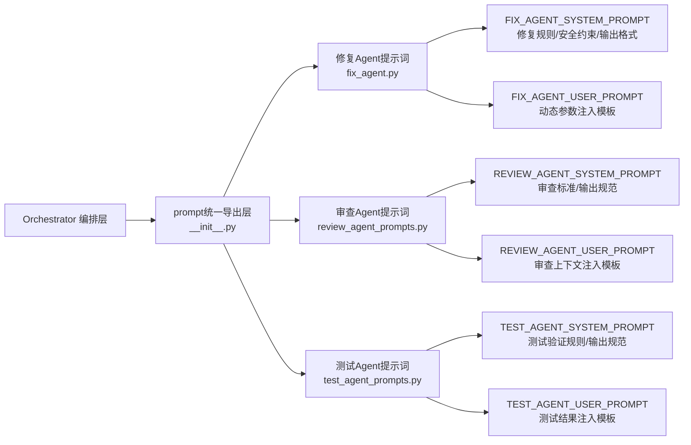

本指南面向高级开发者，介绍SpiderClaw系统中三类核心Agent（修复Agent、审查Agent、测试Agent）的提示词自定义方法、规范与验证流程，适用于需要适配特定业务规则、自定义修复策略、调整审查标准的场景。
Sources: [__init__.py](src/agent/prompts/__init__.py#L1-L15)

## 一、Prompt 架构概览
SpiderClaw的提示词系统采用分层拆分、统一导出的架构设计，所有Agent提示词集中存放在`src/agent/prompts`目录下，按Agent职责拆分独立文件，通过`__init__.py`统一暴露给上层编排模块调用：

所有提示词采用系统提示+用户提示的双模板结构：系统提示定义Agent的角色、规则、输出格式等固定逻辑，用户提示定义动态参数的注入位置，由编排层在运行时填充上下文信息。
Sources: [__init__.py](src/agent/prompts/__init__.py#L1-L15)

## 二、可自定义 Prompt 清单
以下是所有支持自定义的提示词列表，您可以根据业务需求修改对应模板：
| 提示词名称 | 所属Agent | 功能说明 | 文件路径 |
|---------|---------|---------|---------|
| FIX_AGENT_SYSTEM_PROMPT | 修复Agent | 定义代码修复的规则、安全约束、修复策略、输出格式 | [fix_agent.py](src/agent/prompts/fix_agent.py#L3-L118) |
| FIX_AGENT_USER_PROMPT | 修复Agent | 定义错误信息、环境信息、审查反馈等动态参数的注入结构 | [fix_agent.py](src/agent/prompts/fix_agent.py#L120-L152) |
| REVIEW_AGENT_SYSTEM_PROMPT | 审查Agent | 定义代码审查的要点、判定标准、输出格式 | [review_agent_prompts.py](src/agent/prompts/review_agent_prompts.py#L3-L47) |
| REVIEW_AGENT_USER_PROMPT | 审查Agent | 定义原始错误、代码对比、修复描述等上下文的注入结构 | [review_agent_prompts.py](src/agent/prompts/review_agent_prompts.py#L49-L69) |
| TEST_AGENT_SYSTEM_PROMPT | 测试Agent | 定义测试结果分析规则、修复有效性判定标准、输出格式 | [test_agent_prompts.py](src/agent/prompts/test_agent_prompts.py#L3-L37) |
| TEST_AGENT_USER_PROMPT | 测试Agent | 定义代码变更、测试输出、原始错误等信息的注入结构 | [test_agent_prompts.py](src/agent/prompts/test_agent_prompts.py#L39-L57) |

## 三、自定义规范
修改提示词时必须遵守以下规范，避免破坏系统运行逻辑：
### 3.1 不可修改约束
1. **变量占位符不可删除**：所有用户提示中的`{变量名}`占位符（如`{error_locations}`、`{ci_logs}`、`{diff_content}`）是编排层注入参数的固定位置，删除会导致运行时报错
2. **输出格式不可修改**：所有系统提示中定义的JSON输出结构必须完整保留，下游模块依赖固定字段解析Agent输出，修改会导致解析失败
3. **安全规则不建议删除**：修复Agent中的「绝对禁止行为」「安全敏感操作识别与规避」章节是系统安全护栏的核心组成，删除会引入代码注入、恶意操作等风险
Sources: [fix_agent.py](src/agent/prompts/fix_agent.py#L3-L152)

### 3.2 最佳实践
1. **最小修改原则**：仅修改需要调整的规则部分，不要重构整个提示词结构，降低后续版本升级的冲突概率
2. **中文规则优先**：所有新增规则建议使用中文描述，与原有规则风格保持一致，提升大模型理解准确率
3. **约束前置**：新增的禁止类规则建议放在提示词的最前部分，提升大模型的优先级感知
Sources: [review_agent_prompts.py](src/agent/prompts/review_agent_prompts.py#L3-L69)

## 四、常见自定义场景示例
### 4.1 新增企业内部编码规范约束
如果需要让修复Agent遵守企业内部的编码规范，可以在`FIX_AGENT_SYSTEM_PROMPT`的「最小修改与契约保护」章节新增规则：
| 原内容 | 修改后内容 |
|-------|-----------|
| ## 最小修改与契约保护 修复时必须遵守函数契约（签名、输入/输出类型、副作用），避免过度修复：  1. **禁止改变函数签名**：不得修改函数的参数列表或返回值类型 | ## 最小修改与契约保护 修复时必须遵守函数契约（签名、输入/输出类型、副作用），避免过度修复，同时遵守公司编码规范：  1. **禁止改变函数签名**：不得修改函数的参数列表或返回值类型 2. **编码规范约束**：所有修复的代码必须符合PEP8规范，函数命名必须采用蛇形命名法，禁止使用拼音作为变量名 |
Sources: [fix_agent.py](src/agent/prompts/fix_agent.py#L55-L90)

### 4.2 自定义审查标准
如果需要新增审查规则（如要求修复必须附带注释说明），可以在`REVIEW_AGENT_SYSTEM_PROMPT`的「代码质量检查」章节新增要点：
| 原内容 | 修改后内容 |
|-------|-----------|
| 2. **代码质量检查**：    - 是否引入了新的bug或副作用    - 是否符合原项目的代码风格和规范    - 修复后代码是否存在新的语法错误    - 变量、函数引用是否正确 | 2. **代码质量检查**：    - 是否引入了新的bug或副作用    - 是否符合原项目的代码风格和规范    - 修复后代码是否存在新的语法错误    - 变量、函数引用是否正确    - 修复的代码行必须附带注释说明修改原因 |
Sources: [review_agent_prompts.py](src/agent/prompts/review_agent_prompts.py#L10-L20)

## 五、验证与生效
提示词修改后无需编译，直接重启系统即可生效。建议修改完成后先通过[Local Testing Guide](21-local-testing-guide)提供的本地测试流程，使用预设的测试用例验证自定义提示词的效果，确认符合预期后再部署到生产环境。