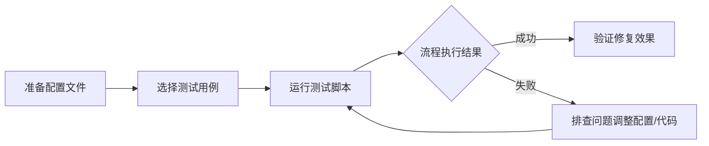

本指南面向中级开发者，介绍如何在本地环境测试 SpiderClaw 自动修复全流程，无需配置 GitHub Webhook 或 CI 流水线即可完成功能验证和调试。
## 前置准备
### 依赖安装
首先确保已安装项目全部依赖：
```bash
pip install -r requirements.txt
```
Sources: [requirements.txt](requirements.txt#L1-Lend)

### 配置文件准备
复制配置模板并填写必要参数：
1. 复制 `config/agent-config.example.yaml` 为 `config/agent-config.yaml`
2. 填写 `github.token` 字段（需要 repo 权限的 GitHub 个人访问令牌）
3. 填写 `openai.api_key` 和 `openai.base_url`、`openai.model_name` 字段（支持兼容 OpenAI API 规范的大模型服务）
4. 其他配置保持默认即可满足本地测试需求

| 配置项 | 说明 | 是否必填 |
|--------|------|----------|
| github.token | GitHub 个人访问令牌 | 是 |
| openai.api_key | 大模型服务 API 密钥 | 是 |
| openai.base_url | 大模型服务 API 地址 | 是 |
| openai.model_name | 使用的大模型名称（推荐 gpt-4o 或同等能力模型） | 是 |

Sources: [agent-config.example.yaml](config/agent-config.example.yaml#L1-L48)

## 标准测试流程
本地测试全流程如下图所示：


### 流程步骤详解
1. **临时仓库创建**：脚本自动创建临时 Git 仓库，复制测试文件并初始化提交，模拟真实 GitHub 仓库环境
2. **错误日志生成**：运行测试用例文件，捕获运行时输出和错误信息，模拟 CI 流水线日志
3. **模拟事件构造**：生成符合 GitHub Webhook 规范的模拟事件，无需实际接入 GitHub 服务
4. **错误解析**：调用错误解析工具从日志中提取错误位置、类型和详情
5. **修复Agent执行**：生成修复代码并输出变更描述和修改内容
6. **审查Agent执行**：检查修复的合理性、安全性和合规性，拦截高风险变更
7. **测试Agent执行**：验证修复后的代码是否解决原问题且不引入新错误
8. **最终验证**：直接运行修复后的文件，确认修复有效性

Sources: [test_fix_flow.py](local_test/test_fix_flow.py#L1-L301)

### 内置测试用例
项目已预置多类常见错误测试用例，位于 `local_test` 目录：

| 测试文件名 | 错误类型 | 描述 |
|------------|----------|------|
| test_syntax_error_1.py | 语法错误 | 括号不匹配 |
| test_syntax_error_2.py | 语法错误 | 字符串引号不闭合 |
| test_syntax_error_3.py | 语法错误 | 缩进错误 |
| test_runtime_error_1.py | 运行时错误 | 列表索引越界 |
| test_runtime_error_2.py | 运行时错误 | 除以零 |

默认运行的测试用例为除以零错误，你可以修改 `test_fix_flow.py` 最后 `main` 函数中的调用代码，切换其他测试用例运行。
Sources: [test_fix_flow.py](local_test/test_fix_flow.py#L283-L301)

## 自定义测试用例
如果你需要测试特定场景的错误修复能力，可以按以下步骤操作：
1. 在 `local_test` 目录下创建新的 Python 文件，编写包含目标错误的代码
2. 在 `test_fix_flow.py` 的 `main` 函数中添加调用，指定你的测试文件路径和描述
3. 运行 `python local_test/test_fix_flow.py` 执行测试

示例自定义测试调用：
```python
asyncio.run(test_fix_flow(
    "local_test/test_custom_error.py",
    "自定义错误 - 未定义变量引用"
))
```

Sources: [test_fix_flow.py](local_test/test_fix_flow.py#L283-L301)

## 常见问题排查
| 问题现象 | 可能原因 | 解决方案 |
|----------|----------|----------|
| 提示找不到 config/agent-config.yaml | 未复制配置模板 | 复制 config/agent-config.example.yaml 为 config/agent-config.yaml |
| OpenAI API 调用失败 | API 密钥/地址配置错误 | 检查 openai.api_key 和 openai.base_url 配置是否正确 |
| Git 命令执行失败 | 系统未安装 Git 或未加入 PATH | 安装 Git 并确保可在命令行正常调用 |
| 修复流程卡在某一步 | 大模型响应超时 | 调整 openai.timeout 配置，或更换网络环境 |

## 后续阅读
- 单元测试编写规范参考：[Unit Testing Best Practices](22-unit-testing-best-practices)
- 更多问题排查方案：[Common Troubleshooting](24-common-troubleshooting)