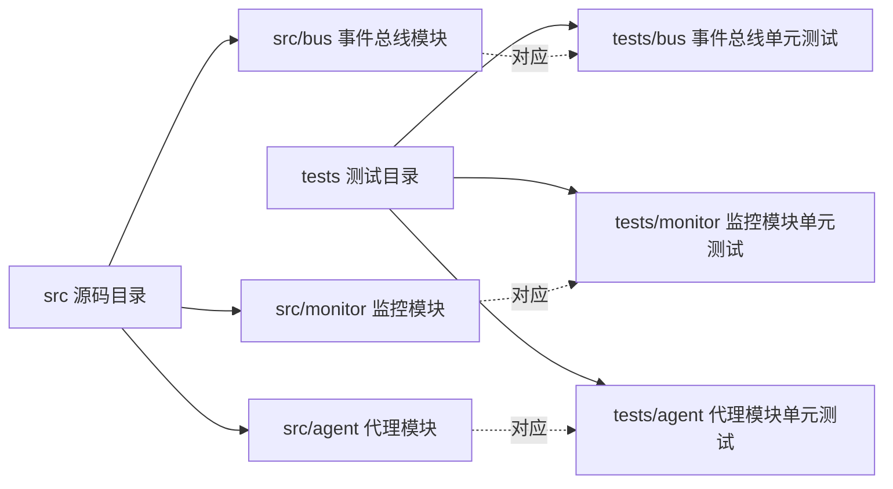

本页面面向中级开发者，规范SpiderClaw项目单元测试的编写标准、最佳实践与验证方法，确保测试用例的可维护性、覆盖率和有效性，所有规范均基于项目现有实践提炼。

## 1. 测试框架与基础配置
本项目采用`pytest`作为核心测试框架，默认集成`pytest-asyncio`支持异步组件测试，无需额外配置环境变量即可直接运行测试。
项目根目录下的`tests/conftest.py`已自动将`src`目录加入Python路径，测试用例中可直接导入`src`下的所有模块，无需手动修改`sys.path`。

Sources: [conftest.py](tests/conftest.py#L1-L11), [pyproject.toml](pyproject.toml#L24-L25)

## 2. 单元测试目录规范
单元测试文件必须放置在`tests`目录下，且目录结构与`src`源码目录完全对应，方便根据模块快速查找对应的测试用例：

测试文件必须以`test_`为前缀命名，例如事件总线的测试文件命名为`test_event_bus.py`。
Sources: [仓库结构](##ENVIRONMENT)

## 3. 测试用例编写规范
所有单元测试用例需遵循以下统一规范，保证可读性和一致性：
### 3.1 命名规范
- 测试函数以`test_`为前缀，使用下划线分隔的小写命名，清晰描述测试场景，例如`test_event_bus_backpressure`表示测试事件总线的反压机制
- 测试用例的docstring需简明说明测试的核心逻辑，方便后续维护者快速理解测试目的
### 3.2 异步测试规范
所有异步方法的测试用例必须添加`@pytest.mark.asyncio`装饰器，否则pytest无法正确执行异步测试逻辑
### 3.3 测试隔离规范
每个测试用例需独立创建待测模块的实例，禁止复用全局实例，避免不同测试用例之间的状态污染
### 3.4 断言规范
每个测试用例仅验证一个核心逻辑，断言需明确具体的预期值，禁止使用模糊的断言（如`assert True`）

Sources: [test_event_bus.py](tests/bus/test_event_bus.py#L1-L158)

## 4. 常见测试模式参考
根据项目现有测试实践，总结以下高频测试模式，可直接参考对应样例编写：
| 测试模式 | 适用场景 | 参考样例 |
| --- | --- | --- |
| 核心功能验证 | 模块主流程逻辑的正确性验证 | `test_event_bus_publish_subscribe` |
| 边界场景测试 | 队列满、LRU上限、参数极值等极端情况验证 | `test_event_bus_backpressure`、`test_event_bus_processed_ids_lru` |
| 异常防御测试 | 重复事件、非法输入、签名无效等异常场景验证 | `test_event_bus_duplicate_detection` |
| 可观测性验证 | 统计指标、监控数据的正确性验证 | `test_event_bus_stats` |
Sources: [test_event_bus.py](tests/bus/test_event_bus.py#L1-L158)

## 5. 测试执行与验证
### 5.1 运行测试
- 运行所有单元测试：`pytest tests/`
- 运行指定模块的单元测试：`pytest tests/bus/`
- 运行单个测试文件：`pytest tests/bus/test_event_bus.py`
### 5.2 质量要求
- 核心模块（事件总线、Agent编排、监控）的单元测试覆盖率需达到80%以上
- 所有新增功能必须配套对应的单元测试，否则无法合并到主干分支
如需进行端到端的本地功能测试，请参考[本地测试指南](21-local-testing-guide)，测试过程中遇到问题可参考[常见故障排查](24-common-troubleshooting)。