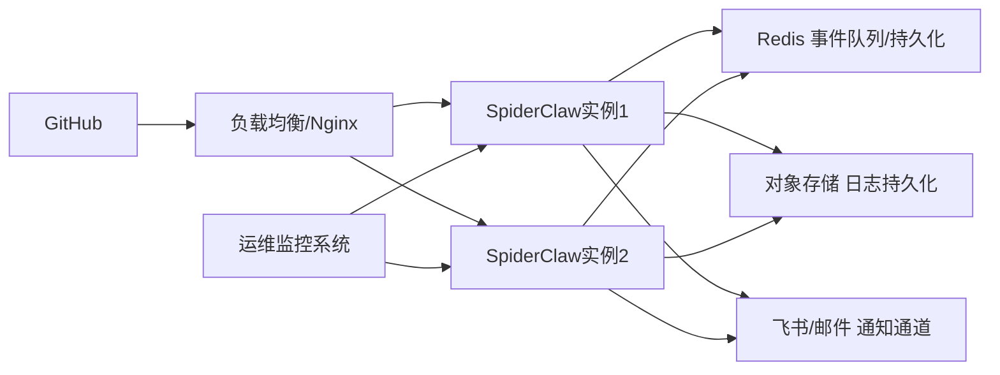

本指南面向高级开发者，提供SpiderClaw自动诊断修复系统的生产环境标准化部署方案，覆盖环境准备、配置优化、服务启停、高可用架构、运维监控全流程，确保系统稳定、安全、高效运行。

## 1. 前置要求
### 1.1 系统与依赖要求
生产环境最低配置要求：
- 操作系统：Linux (推荐 Ubuntu 22.04+/CentOS 8+) / Windows Server 2019+
- Python版本：3.10 ~ 3.12
- 硬件配置：2核4G内存，10G以上可用磁盘空间
- 网络要求：可访问GitHub API、LLM服务API，公网80/443端口开放（用于接收GitHub Webhook事件）

所需依赖包版本范围如下：
```txt
langchain>=1.2,<2.0
langgraph>=1.1,<2.0
fastapi>=0.135,<1.0
uvicorn>=0.42,<1.0
pydantic>=2.12,<3.0
```
完整依赖列表可参考项目依赖声明文件。
Sources: [requirements.txt](requirements.txt#L1-L38)

### 1.2 前置配置完成
部署前请确保已完成以下基础配置：
- GitHub Webhook配置：参考 [GitHub Webhook Configuration](6-github-webhook-configuration)
- 飞书通知配置（可选）：参考 [Feishu/Lark Notification Setup](7-feishu-lark-notification-setup)
- 基础参数配置：参考 [Basic Configuration](4-basic-configuration)

## 2. 部署准备步骤
### 2.1 代码与依赖安装
```bash
# 1. 克隆代码到生产环境
git clone <仓库地址>
cd SpiderClaw

# 2. 创建虚拟环境（推荐）
python -m venv venv
# Linux激活：source venv/bin/activate
# Windows激活：venv\Scripts\activate.bat

# 3. 安装生产依赖
pip install -r requirements.txt
```
Sources: [pyproject.toml](pyproject.toml#L1-L1)（默认依赖声明）

### 2.2 配置文件初始化
生产环境必须同时配置环境变量和业务配置文件：
1. 复制环境变量模板：
```bash
cp .env.example .env
```
2. 复制业务配置模板：
```bash
cp config/agent-config.example.yaml config/agent-config.yaml
```
Sources: [.env.example](.env.example#L1-L28), [agent-config.example.yaml](config/agent-config.example.yaml#L1-L48)

## 3. 生产环境配置最佳实践
### 3.1 核心配置项生产值建议
| 配置项 | 开发环境默认值 | 生产环境推荐值 | 说明 |
|--------|----------------|----------------|------|
| `environment` | `development` | `production` | 标记运行环境，生产环境会关闭调试日志、启用安全校验 |
| `debug` | `false` | `false` | 严格关闭调试模式，避免敏感信息泄露 |
| `webhook.secret` | 示例值 | 强随机字符串（长度>16位） | 与GitHub Webhook配置的密钥保持一致，用于校验事件合法性 |
| `agent.max_change_lines` | 20 | 10~30 | 根据业务场景限制单次修复最大变更行数，降低误改风险 |
| `agent.require_human_approval` | `false` | `true` | 开启人工审批，所有生成的修复PR必须经过人工确认后才可合并 |
| `logging.json_format` | `true` | `true` | 启用JSON格式日志，便于对接ELK等日志收集系统 |
| `logging.retention_days` | 30 | 90 | 延长日志保留时间，满足审计要求 |

### 3.2 敏感信息配置规范
所有敏感信息（GitHub Token、OpenAI API Key、飞书密钥）禁止硬编码到配置文件，建议通过以下方式管理：
- 生产环境使用KMS服务加密存储，启动时动态注入
- 容器化部署时通过Secret挂载
- 禁止将包含敏感信息的配置文件提交到代码仓库
Sources: [settings.py](src/config/settings.py#L1-L1)（配置加载逻辑）

## 4. 服务启动与进程管理
### 4.1 基础启动命令
SpiderClaw提供CLI统一入口，生产环境基础启动命令如下：
```bash
# 直接启动服务
python main.py --host 0.0.0.0 --port 8000
```
支持的启动参数：
| 参数 | 说明 | 默认值 |
|------|------|--------|
| `--host/-h` | Webhook服务监听地址 | 0.0.0.0 |
| `--port/-p` | Webhook服务监听端口 | 8000 |
| `--config/-c` | 指定自定义配置文件路径 | config/agent-config.yaml |
| `--reload` | 热重载（生产环境禁止开启） | false |
Sources: [main.py](main.py#L1-L19), [app.py](src/cli/app.py#L1-L143)

### 4.2 生产级进程管理（Systemd示例）
Linux生产环境推荐使用Systemd管理服务进程，配置示例`/etc/systemd/system/spiderclaw.service`：
```ini
[Unit]
Description=SpiderClaw Automatic Fix Service
After=network.target

[Service]
User=spiderclaw
Group=spiderclaw
WorkingDirectory=/opt/SpiderClaw
ExecStart=/opt/SpiderClaw/venv/bin/python main.py --host 127.0.0.1 --port 8000
Restart=always
RestartSec=5
Environment="PATH=/opt/SpiderClaw/venv/bin"
EnvironmentFile=/opt/SpiderClaw/.env

[Install]
WantedBy=multi-user.target
```
启动命令：
```bash
systemctl daemon-reload
systemctl enable spiderclaw
systemctl start spiderclaw
```

### 4.3 容器化部署示例
Dockerfile基础模板：
```dockerfile
FROM python:3.11-slim
WORKDIR /app
COPY requirements.txt .
RUN pip install --no-cache-dir -r requirements.txt
COPY . .
EXPOSE 8000
CMD ["python", "main.py", "--host", "0.0.0.0", "--port", "8000"]
```

## 5. 高可用部署架构
生产环境高可用部署架构如下：

架构说明：
1. 前端挂载负载均衡，多实例部署实现水平扩展，避免单点故障
2. 事件队列使用Redis持久化，服务重启时不丢失未处理事件
3. 日志统一收集到对象存储或日志服务，满足可观测性要求
4. 对接运维监控系统，实时采集服务健康状态、处理成功率等指标
Sources: [event_bus.py](src/bus/event_bus.py#L1-L1), [webhook_server.py](src/monitor/webhook_server.py#L1-L1)

## 6. 运维与监控
### 6.1 健康检查
服务提供健康检查接口，可用于负载均衡健康检测：
```
GET /health
返回：{"status": "ok", "timestamp": 1718000000}
```

### 6.2 日志管理
生产环境日志默认存储在`logs/`目录下，包含以下日志类型：
- 服务运行日志：记录服务启动、停止、异常信息
- 事件处理日志：记录每个Webhook事件的处理全流程
- Agent执行日志：记录自动修复的推理过程、变更内容
建议配置日志轮转，避免磁盘空间占用过高。

### 6.3 常见运维指标
建议监控以下核心指标：
- 服务在线率
- Webhook事件接收成功率
- 自动修复成功率
- API请求延迟
- 队列积压长度

## 7. 升级与回滚
### 7.1 版本升级步骤
1. 备份当前配置文件和日志目录
2. 拉取新版本代码
3. 执行依赖更新：`pip install -r requirements.txt`
4. 重启服务：`systemctl restart spiderclaw`
5. 验证服务健康状态：访问`/health`接口，发送测试事件验证处理流程

### 7.2 回滚方案
如果升级后出现异常，执行以下操作回滚：
1. 停止服务：`systemctl stop spiderclaw`
2. 回滚代码到上一个稳定版本
3. 恢复备份的配置文件
4. 启动服务，验证功能正常

## 下一步参考
- 部署后问题排查：[Common Troubleshooting](24-common-troubleshooting)
- 服务运行命令参考：[CLI Command Reference](16-cli-command-reference)
- 自定义功能扩展：[Custom Tool Development](18-custom-tool-development)