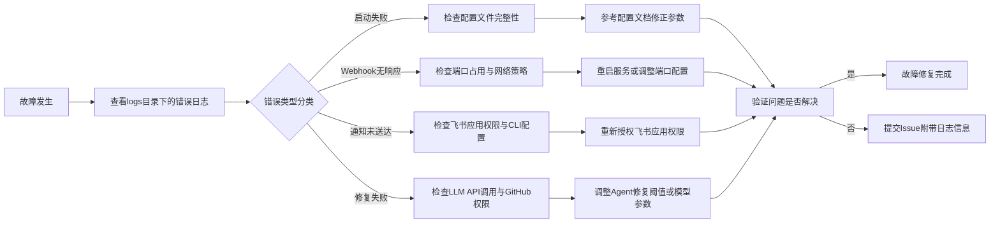

本页面汇总了SpiderClaw自动修复系统运行过程中常见的故障场景、根因分析及解决方案，面向中级开发者提供可落地的排查指引，覆盖启动、配置、Webhook、通知、Agent执行全链路问题。

## 故障排查总流程

Sources: [main.py](main.py#L1-L19) [settings.py](src/config/settings.py#L1-L170)

## 启动类故障
1. 命令执行后无响应直接退出
根因：Python版本不兼容、依赖包缺失
解决方案：检查Python版本是否>=3.10，执行`pip install -r requirements.txt`安装完整依赖包。
Sources: [requirements.txt](requirements.txt) [pyproject.toml](pyproject.toml)

2. 启动时报"Failed to load config file"错误
根因：config/agent-config.yaml格式错误，存在YAML语法问题
解决方案：参考[config/agent-config.example.yaml](config/agent-config.example.yaml)修正语法，检查缩进是否符合YAML规范，移除文件中的非法字符。
Sources: [settings.py](src/config/settings.py#L98-L131)

## 配置类故障
| 错误现象 | 根因分析 | 解决方案 |
| --- | --- | --- |
| Webhook请求返回403签名错误 | GitHub Webhook后台配置的secret与系统配置的webhook.secret不一致 | 重新核对两边的secret值，确保完全匹配 |
| Agent自动修复功能不触发 | agent.enabled配置为false，或者openai.api_key未配置有效密钥 | 将agent.enabled设为true，补充可用的OpenAI API密钥 |
| 日志未生成或路径报错 | logging.dir配置的目录无写入权限 | 手动创建logs目录，或修改logging.dir为拥有写入权限的路径 |
Sources: [settings.py](src/config/settings.py#L9-L92)

## Webhook服务故障
1. GitHub无法推送Webhook事件，提示连接超时
根因：服务器端口未开放、防火墙拦截、公网IP不可达
解决方案：检查8000端口（或自定义端口）是否对外开放，确认安全组策略允许GitHub IP段访问，可通过访问`http://<服务器IP>:8000/health`验证服务是否正常运行。
Sources: [webhook_server.py](src/monitor/webhook_server.py#L98-L107)

2. Webhook返回200但事件未处理
根因：事件类型不在允许列表中，或事件状态不符合触发条件（workflow_run/check_run需为failure状态，PR事件需为opened/synchronize动作）
解决方案：参考[GitHub Webhook Configuration](6-github-webhook-configuration)配置允许的事件类型，确认触发事件符合自动修复触发规则。
Sources: [webhook_server.py](src/monitor/webhook_server.py#L121-L177)

## 飞书通知故障
1. 修复完成后未收到飞书通知
根因：lark.enabled配置为false、飞书应用权限不足、lark-cli未安装
解决方案：将lark.enabled设为true，按照[Feishu/Lark Notification Setup](7-feishu-lark-notification-setup)安装lark-cli并配置应用权限，确认notify_users/notify_groups配置的ID正确。
Sources: [lark_notify.py](src/notify/lark_notify.py#L151-L199) [FEISHU_SETUP.md](docs/FEISHU_SETUP.md)

2. 通知卡片内容显示异常
根因：飞书应用版本过低，不支持交互式卡片格式
解决方案：升级飞书客户端到最新版本，或调整通知模板使用纯文本格式。
Sources: [lark_notify.py](src/notify/lark_notify.py#L13-L124)

## Agent自动修复故障
1. 修复失败，提示"max_change_lines exceeded"
根因：错误修复需要修改的行数超过配置的agent.max_change_lines阈值
解决方案：适当调大agent.max_change_lines参数，或手动处理复杂度较高的错误。
Sources: [settings.py](src/config/settings.py#L38)

2. 自动创建PR失败
根因：github.token无仓库写入权限，或者default_branch配置与实际仓库默认分支不一致
解决方案：给GitHub令牌添加repo权限，核对default_branch配置值与仓库实际默认分支是否一致。
Sources: [settings.py](src/config/settings.py#L44-L47)

## 快速排查工具
可通过以下命令快速验证各组件状态：
- 验证配置有效性：`python main.py config check`
- 验证Webhook服务状态：`curl http://localhost:8000/health`
- 验证飞书通知配置：`python main.py notify test --user <user_open_id>`
- 查看实时运行日志：`tail -f logs/spiderclaw.log`
Sources: [cli/app.py](src/cli/app.py)

## 相关参考
- [Basic Configuration](4-basic-configuration)
- [Local Testing Guide](21-local-testing-guide)
- [Production Deployment Guide](23-production-deployment-guide)