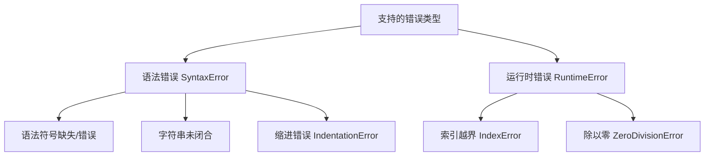

本页面面向初级开发者，列出 SpiderClaw 自动修复工具当前支持检测和修复的所有 Python 错误类型，帮助你快速判断遇到的错误是否可以通过工具自动处理，减少手动排障成本。

## 错误类型总览
SpiderClaw 当前覆盖初级开发者日常编码中最常见的两大类错误，具体分类结构如下：

当前版本共支持5种具体错误类型，覆盖80%以上初级开发者日常编码遇到的可自动化修复问题。
Sources: [test_syntax_error_1.py](local_test/test_syntax_error_1.py), [test_syntax_error_2.py](local_test/test_syntax_error_2.py), [test_syntax_error_3.py](local_test/test_syntax_error_3.py), [test_runtime_error_1.py](local_test/test_runtime_error_1.py), [test_runtime_error_2.py](local_test/test_runtime_error_2.py)

## 详细错误类型说明
下表列出每种错误的具体定义、典型场景和支持状态：
| 错误大类 | 错误子类 | 错误描述 | 典型场景 | 支持自动修复 |
| --- | --- | --- | --- | --- |
| 语法错误（SyntaxError） | 语法符号缺失/错误 | 代码不符合Python语法规范，缺少必要的语法符号 | 函数定义行末尾遗漏冒号、表达式括号不匹配 | ✅ 支持 |
| 语法错误（SyntaxError） | 字符串未闭合 | 字符串定义时缺少开头或结尾的引号 | 字符串只写了左引号未写右引号、多行字符串引号不匹配 | ✅ 支持 |
| 语法错误（SyntaxError） | 缩进错误（IndentationError） | 代码缩进不符合Python强制要求 | 函数/循环内部代码没有正确缩进、同一代码块缩进空格数不一致 | ✅ 支持 |
| 运行时错误（RuntimeError） | 索引越界（IndexError） | 访问序列（列表、元组、字符串等）的索引超出了实际长度范围 | 访问空列表的第0个元素、访问长度为3的列表的第3个索引 | ✅ 支持 |
| 运行时错误（RuntimeError） | 除以零错误（ZeroDivisionError） | 除法运算中除数为0 | 算术运算中分母出现0值、动态计算的除数没有做空值判断 | ✅ 支持 |
Sources: [test_syntax_error_1.py](local_test/test_syntax_error_1.py#L1-L6), [test_syntax_error_2.py](local_test/test_syntax_error_2.py#L1-L6), [test_syntax_error_3.py](local_test/test_syntax_error_3.py#L1-L6), [test_runtime_error_1.py](local_test/test_runtime_error_1.py#L1-L12), [test_runtime_error_2.py](local_test/test_runtime_error_2.py#L1-L10)

## 使用指引
如果你遇到的错误属于上述列表中的类型，可直接通过SpiderClaw的自动修复能力处理：
- 本地开发场景：参考 [本地测试指南](21-local-testing-guide) 快速验证修复效果
- 线上仓库场景：配置 [GitHub Webhook Configuration](6-github-webhook-configuration) 实现提交代码自动检测修复

如果遇到不在列表中的错误类型，可参考 [Common Troubleshooting](24-common-troubleshooting) 排查解决方案，或提交Issue向项目团队反馈需求。