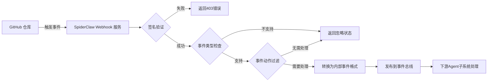

本页面指导你完成GitHub Webhook与SpiderClaw系统的对接配置，实现GitHub仓库事件的自动接收、验证与分发，为后续的CI错误自动诊断修复提供事件输入。配置完成后，系统可自动捕获流水线失败、PR更新等事件，触发后续的智能修复流程。

## 架构与工作流程
GitHub Webhook是SpiderClaw系统的事件入口，整体工作流程如下：

Webhook服务遵循最小处理原则，仅对合法且符合触发规则的事件进行转发，保障系统安全性与运行效率。
Sources: [webhook_server.py](src/monitor/webhook_server.py#L26-L184)

## 前置准备
1. 你需要拥有目标GitHub仓库的管理员权限，才能进行Webhook配置操作
2. 生成高强度的Webhook密钥，用于后续的签名验证：
```bash
openssl rand -hex 32
```
请妥善保存生成的32位十六进制密钥，后续GitHub端和服务端配置都需要使用该值。
Sources: [01-github-webhook-setup.md](docs/01-github-webhook-setup.md#L18-L23)

## GitHub端配置步骤
1. 进入目标GitHub仓库，依次点击 `Settings` → `Webhooks` → `Add webhook` 进入配置页面
2. 填写Payload URL：格式为 `https://你的服务公网域名/webhook/github`，确保该地址可被GitHub公网访问
3. Content type 选择 `application/json` 选项，请勿使用默认的`application/x-www-form-urlencoded`格式
4. Secret 字段填写前置准备阶段生成的密钥
5. 在"Which events would you like to trigger this webhook?"选项区域，勾选以下三种事件：
   - Workflow runs
   - Pull requests
   - Check runs
6. 点击`Add webhook`按钮完成GitHub端配置
Sources: [01-github-webhook-setup.md](docs/01-github-webhook-setup.md#L24-L33)

## 服务端配置
SpiderClaw支持三种配置方式，优先级顺序为：命令行参数 > 环境变量 > 配置文件，你可以根据部署场景选择合适的方式。

### 配置方式对比
| 配置方式 | 适用场景 | 操作方法 |
| --- | --- | --- |
| 配置文件（推荐） | 生产环境部署 | 复制`config/agent-config.example.yaml`为`config/agent-config.yaml`，填写webhook相关配置项 |
| 环境变量 | 容器化/K8s部署 | 通过环境变量传递配置，嵌套配置使用双下划线分隔，例如`WEBHOOK__GITHUB__SECRET` |
| 命令行参数 | 本地调试/临时测试 | 启动服务时通过参数直接指定，例如`--secret your-secret --port 8000` |
Sources: [settings.py](src/config/settings.py#L69-L73), [01-github-webhook-setup.md](docs/01-github-webhook-setup.md#L35-L54)

### 核心配置项说明
| 配置项 | 类型 | 必填 | 默认值 | 说明 |
| --- | --- | --- | --- | --- |
| webhook.secret | 字符串 | 是 | 无 | GitHub Webhook密钥，需与GitHub端配置的Secret完全一致 |
| webhook.host | 字符串 | 否 | 0.0.0.0 | 服务监听的主机地址，生产环境可配置为指定内网IP |
| webhook.port | 整数 | 否 | 8000 | 服务监听的端口，可根据部署需求调整 |
| webhook.allowed_events | 数组 | 否 | ["workflow_run", "pull_request", "check_run"] | 允许接收的GitHub事件类型，不建议修改默认值 |
| webhook.event_queue_maxsize | 整数 | 否 | 1000 | 事件队列最大容量，超过后新事件会返回503错误 |
| webhook.max_processed_ids | 整数 | 否 | 10000 | 已处理事件ID的最大缓存数量，用于事件去重 |
Sources: [settings.py](src/config/settings.py#L9-L23)

## 启动与验证
### 启动服务
```bash
# 生产环境启动（使用配置文件）
python main.py webhook start --config config/agent-config.yaml

# 开发环境启动（启用热重载）
python main.py webhook start --reload --secret "你的测试密钥"
```
Sources: [01-github-webhook-setup.md](docs/01-github-webhook-setup.md#L56-L63)

### 验证服务状态
服务启动后，可通过健康检查接口验证运行状态：
```bash
curl http://localhost:8000/health
```
正常返回示例如下：
```json
{
  "status": "ok",
  "service": "github-webhook",
  "start_time": "2024-04-24T12:00:00+00:00",
  "queue_size": 0,
  "published_count": 0,
  "dropped_count": 0,
  "duplicate_count": 0,
  "processed_ids_count": 0,
  "uptime_seconds": 123.45
}
```
Sources: [webhook_server.py](src/monitor/webhook_server.py#L98-L107), [01-github-webhook-setup.md](docs/01-github-webhook-setup.md#L65-L82)

## 事件处理规则
服务会对接收的GitHub事件进行多层过滤，仅处理符合以下规则的事件：
| 事件类型 | 触发条件 | 用途 |
| --- | --- | --- |
| pull_request | action为`opened`或`synchronize` | 捕获PR创建和更新事件，关联修复分支与PR编号 |
| workflow_run | conclusion为`failure` | 捕获CI流水线运行失败事件，触发自动修复流程 |
| check_run | conclusion为`failure` | 捕获具体检查项失败事件，精确定位错误原因 |
不符合上述条件的事件会被直接忽略，不会进入后续处理流程，降低系统资源消耗。
Sources: [webhook_server.py](src/monitor/webhook_server.py#L154-L177)

## 常见问题排查
| 错误码 | 问题原因 | 解决方案 |
| --- | --- | --- |
| 400 Bad Request | 缺少GitHub必填请求头、JSON payload格式错误或事件转换失败 | 检查请求头是否完整，payload是否为合法JSON格式，确认GitHub事件格式未发生变更 |
| 403 Forbidden | 签名验证失败 | 确认GitHub端配置的Secret与服务端配置的Secret完全一致，检查传输过程中是否存在密钥截断问题 |
| 503 Service Unavailable | 事件队列已满 | 调大`webhook.event_queue_maxsize`配置，或优化下游Agent处理性能，排查是否存在事件堆积 |
| 事件被忽略 | 事件类型不支持或动作不符合触发条件 | 检查GitHub Webhook勾选的事件类型是否包含三种必填事件，确认事件动作符合触发规则 |
Sources: [webhook_server.py](src/monitor/webhook_server.py#L117-L182), [01-github-webhook-setup.md](docs/01-github-webhook-setup.md#L133-L143)

## 后续步骤
完成Webhook配置后，你可以进行以下操作：
1. 配置通知通道：[Feishu/Lark Notification Setup](7-feishu-lark-notification-setup)，实现修复进度的实时推送
2. 进行本地调试：[Local Testing Guide](21-local-testing-guide)，验证完整修复流程
3. 了解内部事件流转机制：[Event Bus Design & Implementation](9-event-bus-design-and-implementation)