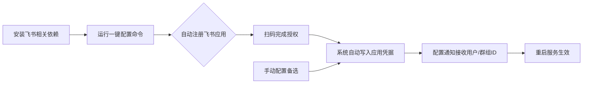

本页面用于指导中级开发者完成SpiderClaw系统的飞书（Lark）通知功能配置，配置完成后系统会在自动修复任务执行完成、异常报错等场景推送实时通知到指定飞书用户或群组，帮助团队快速掌握代码修复进度。本页面仅覆盖通知配置相关内容，如需了解通知子系统的底层实现，请参考[通知子系统深度解析](13-notification-subsystem-deep-dive)。

## 前置准备
在开始配置前，请确认满足以下条件：
1. 拥有飞书企业版账号，且具备企业自建应用创建权限（个人版飞书不支持该功能）
2. 已完成SpiderClaw基础安装，参考[Installation Guide](3-installation-guide)
3. 已完成基础配置，参考[Basic Configuration](4-basic-configuration)
Sources: [FEISHU_SETUP.md](docs/FEISHU_SETUP.md#L159-L160)

## 配置流程总览

SpiderClaw提供一键自动配置能力，无需手动访问飞书开发者后台，全程仅需扫码即可完成90%以上的配置工作；如自动配置失败也支持手动配置流程。
Sources: [FEISHU_SETUP.md](docs/FEISHU_SETUP.md#L5-L10), [lark_register.py](src/notify/lark_register.py#L1-L156)

## 自动配置步骤（推荐）
### 步骤1：安装依赖
提供两种安装方式可按需选择：
方式一：完整安装（推荐，包含所有功能依赖）
```bash
pip install -e ".[all]"
```
方式二：仅安装飞书配置所需依赖
```bash
pip install qrcode pillow lark-oapi lark-cli
```
Sources: [FEISHU_SETUP.md](docs/FEISHU_SETUP.md#L11-L26)

### 步骤2：运行一键配置命令
支持自定义参数适配不同场景：
```bash
# 默认配置（推荐）
spiderclaw setup feishu

# 自定义应用名称和描述
spiderclaw setup feishu --app-name "代码自动修复机器人" --app-description "自动修复代码CI错误的智能助手"

# 指定自定义配置文件路径
spiderclaw setup feishu --config /path/to/your/config.yaml
```
Sources: [FEISHU_SETUP.md](docs/FEISHU_SETUP.md#L30-L40)

### 步骤3：完成扫码授权
运行命令后，系统会自动打开浏览器展示飞书授权二维码，或在终端展示授权链接和验证码：
- 方式1：使用飞书手机APP扫描二维码完成授权
- 方式2：手动访问授权链接，输入页面上的验证码完成授权
授权有效期为5分钟，超时后需重新运行命令。
Sources: [FEISHU_SETUP.md](docs/FEISHU_SETUP.md#L61-L80), [lark_register.py](src/notify/lark_register.py#L43-L72)

### 步骤4：确认配置写入
授权成功后，系统会自动将生成的App ID和App Secret写入配置文件`config/agent-config.yaml`，无需手动操作。
Sources: [FEISHU_SETUP.md](docs/FEISHU_SETUP.md#L94-L99)

### 步骤5：配置通知接收对象
打开`config/agent-config.yaml`，找到lark配置段，添加需要通知的用户open_id或群组chat_id：
```yaml
lark:
  # 是否启用飞书通知
  enabled: true
  # 飞书应用ID（自动生成无需修改）
  app_id: "cli_xxxxxxxxxxxxxxxx"
  # 飞书应用密钥（自动生成无需修改）
  app_secret: "xxxxxxxxxxxxxxxxxxxxxxxxxxxxxxxx"
  # 需要通知的用户open_id列表
  notify_users: 
    - "ou_xxxxxxxxxxxxxxxxxxxxxxxxxxxxxxxx"
  # 需要通知的群组chat_id列表
  notify_groups:
    - "oc_xxxxxxxxxxxxxxxxxxxxxxxxxxxxxxxx"
```
获取ID的方式：
1. 用户open_id：在飞书客户端用户个人信息页查看，或使用`lark-cli contact +user-search --keyword "用户名"`查询
2. 群组chat_id：在飞书群组设置页查看，或使用`lark-cli im +chat-search --keyword "群组名称"`查询
Sources: [FEISHU_SETUP.md](docs/FEISHU_SETUP.md#L119-L149)

### 步骤6：重启服务生效
配置完成后重启SpiderClaw服务即可生效，可通过CLI命令发送测试通知验证配置是否正确：
```bash
spiderclaw notify test --receiver "ou_xxxxxxxxxxxxxxxx"
```

## 手动配置步骤（备选）
如果自动配置失败，可通过以下步骤手动完成配置：
1. 访问[飞书开放平台](https://open.feishu.cn/)，使用企业账号登录
2. 创建企业自建应用，启用「机器人」能力
3. 申请以下权限并提交发布：
   - `im:message:send_as_bot`：以机器人身份发送消息
   - `im:chat:readonly`：读取群组信息
   - `contact:user.base:readonly`：读取用户基本信息
4. 获取应用的App ID和App Secret，填入`config/agent-config.yaml`的lark配置段
5. 按照上述自动配置的步骤5、6完成后续配置
Sources: [FEISHU_SETUP.md](docs/FEISHU_SETUP.md#L175-L183)

## 配置项说明
| 配置项 | 类型 | 必填 | 说明 |
|--------|------|------|------|
| lark.enabled | boolean | 是 | 是否启用飞书通知功能，默认false |
| lark.app_id | string | 是 | 飞书应用ID，自动配置生成无需手动填写 |
| lark.app_secret | string | 是 | 飞书应用密钥，自动配置生成无需手动填写 |
| lark.notify_users | list<string> | 否 | 需要接收通知的用户open_id列表，至少配置notify_users或notify_groups其中一项 |
| lark.notify_groups | list<string> | 否 | 需要接收通知的群组chat_id列表，至少配置notify_users或notify_groups其中一项 |
| lark.as_bot | boolean | 否 | 是否以机器人身份发送消息，默认true |
Sources: [FEISHU_SETUP.md](docs/FEISHU_SETUP.md#L123-L138)

## 通知模板说明
SpiderClaw内置两种飞书通知模板，可满足不同场景需求：
### 1. 自动修复结果通知
用于代码自动修复任务完成时推送，包含修复状态、错误类型、原分支、修复说明、PR链接（成功时）/错误信息（失败时）等信息，由`generate_repair_notification`函数生成。
效果示例：
- 成功状态：绿色卡片，展示✅修复成功标识，附带PR跳转链接
- 失败状态：红色卡片，展示❌修复失败标识，附带详细错误信息
Sources: [lark_notify.py](src/notify/lark_notify.py#L13-L124)

### 2. 通用通知
用于系统运行异常、服务启停等通用场景的通知，为纯文本格式，由`generate_simple_notification`函数生成。
Sources: [lark_notify.py](src/notify/lark_notify.py#L127-L148)

## 常见问题排查
| 问题现象 | 可能原因 | 解决方案 |
|----------|----------|----------|
| 扫码后提示「应用不存在」或「无权访问」 | 使用了个人版飞书，或没有企业应用创建权限 | 切换为企业版飞书账号，联系企业管理员开通应用创建权限 |
| 授权超时 | 二维码生成后超过5分钟未扫码 | 重新运行配置命令生成新的二维码 |
| 配置完成后无法发送消息 | 1. 应用未发布<br>2. 用户/群组ID配置错误<br>3. 机器人未加入对应群组<br>4. 网络无法访问飞书开放平台 | 1. 确认飞书开放平台上应用已发布上线<br>2. 核对notify_users/notify_groups中的ID是否正确<br>3. 将机器人添加到需要通知的群组中<br>4. 检查网络代理配置，确认可访问飞书开放平台 |
| 发送消息提示权限不足 | 应用未申请对应权限 | 到飞书开放平台申请所需权限并重新发布应用 |
Sources: [FEISHU_SETUP.md](docs/FEISHU_SETUP.md#L158-L173)

## 后续操作
- 如需了解通知子系统的底层设计和扩展方式，请参考[Notification Subsystem Deep Dive](13-notification-subsystem-deep-dive)
- 如需完成生产环境部署，请参考[Production Deployment Guide](23-production-deployment-guide)
- 如需配置GitHub Webhook触发自动修复，请参考[GitHub Webhook Configuration](6-github-webhook-configuration)