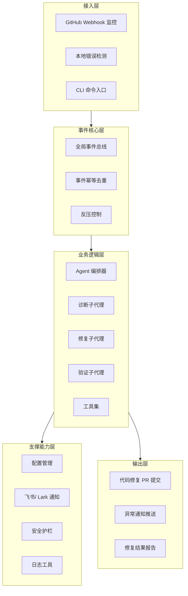
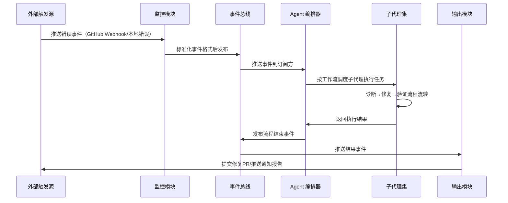

本页面概述 SpiderClaw 事件驱动自动诊断与修复系统的整体架构设计、核心组件职责、数据流模式和能力边界，帮助中级开发者快速建立系统全局认知。
Sources: [pyproject.toml](./pyproject.toml#L8)

## 1. 分层架构总览
SpiderClaw 采用经典的事件驱动分层架构设计，以事件总线为核心枢纽，所有组件松耦合协作，整体分为5个逻辑层：

Sources: [src/bus/event_bus.py](./src/bus/event_bus.py#L11-L161), [main.py](./main.py#L12-L14)

## 2. 核心组件职责
| 组件分类 | 组件名称 | 核心职责 | 对应代码路径 |
|---------|---------|---------|-------------|
| 接入层 | 监控模块 | 接收外部事件（GitHub 错误事件、本地运行时/语法错误），标准化后写入事件总线 | [src/monitor/](./src/monitor/) |
| 接入层 | CLI 模块 | 提供本地命令行操作入口，支持本地测试、手动触发修复等操作 | [src/cli/](./src/cli/) |
| 核心层 | 事件总线 | 全局事件枢纽，支持异步事件收发、幂等去重、反压控制，解耦上下游组件 | [src/bus/event_bus.py](./src/bus/event_bus.py) |
| 业务层 | Agent 编排器 | 接收事件后调度不同子代理完成诊断、修复、验证全流程，控制执行状态流转 | [src/agent/orchestrator.py](./src/agent/orchestrator.py) |
| 业务层 | 子代理集 | 分工执行具体任务：错误根因诊断、代码修复生成、修复结果验证、合规检查 | [src/agent/subagents/](./src/agent/subagents/) |
| 支撑层 | 配置模块 | 统一管理系统配置，支持环境变量、配置文件多源加载 | [src/config/settings.py](./src/config/settings.py) |
| 支撑层 | 通知模块 | 对接飞书/Lark 开放平台，推送修复进度、结果通知 | [src/notify/lark_notify.py](./src/notify/lark_notify.py) |
| 支撑层 | 安全护栏 | 执行修复代码安全检查，禁止高危操作，避免破坏性修复 | [src/safety/](./src/safety/) |
Sources: [Repository Structure](#repository-structure-top-2-levels)

## 3. 核心数据流
系统所有流程均以事件为驱动，标准数据流如下：

Sources: [src/bus/event_bus.py](./src/bus/event_bus.py#L43-L77)

## 4. 核心能力边界
| 能力分类 | 支持场景 | 不支持场景 |
|---------|---------|-----------|
| 错误诊断 | Python 语法错误、运行时错误、CI 执行错误根因分析 | 编译型语言错误、业务逻辑类深度错误 |
| 代码修复 | 小范围语法修正、依赖缺失修复、常见运行时错误修复 | 架构级改动、核心业务逻辑调整 |
| 触发方式 | GitHub Webhook 自动触发、CLI 手动触发、本地目录监控触发 | 非 Git 仓库代码修复、生产环境热修复 |
| 通知渠道 | 飞书/Lark 通知、控制台输出、GitHub PR 评论 | 企业微信、邮件、短信等其他通知渠道 |
Sources: [docs/02-自动修复功能快速开始.md](./docs/02-自动修复功能快速开始.md)

## 后续阅读指引
如需深入了解各模块设计与实现，可按以下顺序阅读：
1. 核心组件实现：[事件总线设计与实现](9-event-bus-design-and-implementation) → [Agent 编排工作流](10-agent-orchestration-workflow)
2. 子系统深入：[Agent 子系统深度解析](11-agent-subsystem-deep-dive) → [监控子系统深度解析](12-monitor-subsystem-deep-dive) → [通知子系统深度解析](13-notification-subsystem-deep-dive)
3. 开发指南：[CLI 命令参考](16-cli-command-reference) → [自定义工具开发](18-custom-tool-development)